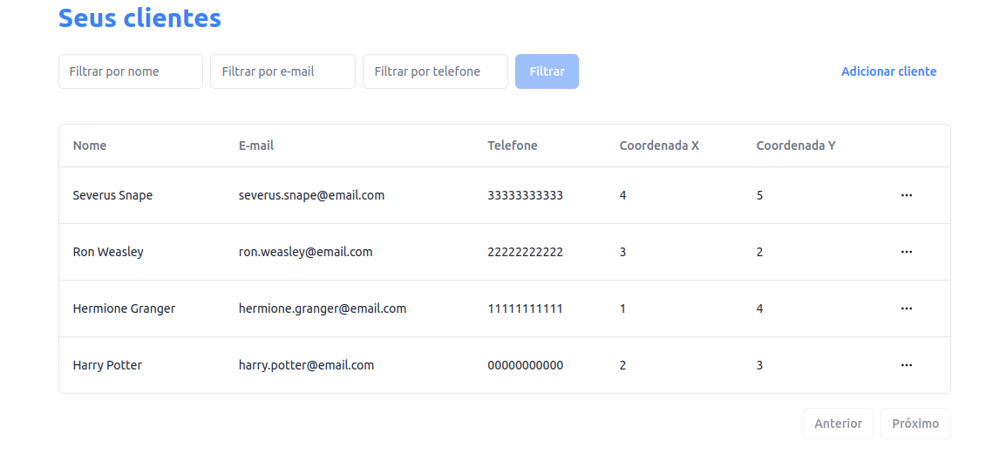

# limpsys

O **limpsys** é um sistema de gerenciamento de clientes para empresas de limpeza residencial. A aplicação foi feita com **React.js** no frontend, **Node.js** no backend e **PostgreSQL**

## Tecnologias utilizadas
### Frontend
- React.js;
- Tailwind CSS;
- ShadcnUI;
- TypeScript;
- Vite;
- Vitest.

### Backend
- Node.js;
- Express;
- Node-Postgres;
- TypeScript;
- Tsyringe;
- Vitest.

### Banco de dados
- PostgreSQL.

A estrutura inicial do banco de dados está presente me `db/initdb.sql` e é executado quando o container sobe.

## Como utilizar
### Rodar localmente
Para rodar o projeto localmente você precisa ter o `Docker` instalado, assim como o `Node.js`.

#### API
Iremos utilizar o `Docker Compose` para subir a API juntamente com o banco de dados `Postgres`.
```bash
docker compose up
```
A API estará disponível no endereço em http://localhost:3333.

#### UI
A interface do usuário irá utilizar a máquina do host. Foi decidido utilizar dessa maneira devido a uma enorme demora ao buildar o container para utilizar a interface no Docker. Portanto, será preciso ir até a pasta `web` e rodar os comandos abaixo:
```bash
npm install
npm run dev
```

A aplicação estará disponível em http://localhost:5173.

Vamos saber mais sobre as funcionalidades da aplicação.

### Funcionalidades
#### Página inicial

Na página inicial você tem uma  mensagem de boas-vindas,quantidade de clientes cadastrados e atalhos para as ações de _Adicionar cliente_, _Ver clientes cadastrados_ e _Calcular melhor rota_.

#### Cadastro de clientes

Ao clicar em **Adicionar cliente** um modal irá abrir. Neste modal você irá cadastrar o **nome**, **e-mail**, **telefone** e as **coordenadas** do cliente. Ao clicar em salvar o usuário será salvo. O formulário possui validações que são mostradas após o clicar no botão.

#### Listagem de clientes

Os clientes são mostrados em uma tabela. Você pode excluir um usuário clicando nos 3 pontos à direita de cada cliente na tabela.


#### Cálculo de rotas

Ao entrar na tela de cálculo de rota, você vai precisar clicar no botão de cálculo. Por ser um fluxo que pode vir a se tornar demorado rapidamente (de forma fatorial, mais precisamente), foi decidido deixar a rota ser calculada manualmente e não simplesmente ao entrar na tela.

A rota sempre vai iniciar na empresa, a melhor rota e voltar à empresa.

### Testes
Para rodar os testes basta ir na pasta de onde você quer testar e rodar o seguinte comando:
```bash
npm run test
```

## Pontos de melhoria
Para deixar o projeto mais robusto podemos implementar as seguintes funcionalidades:
- autenticação;
- gerenciamento de erros no frontend mais detalhado.